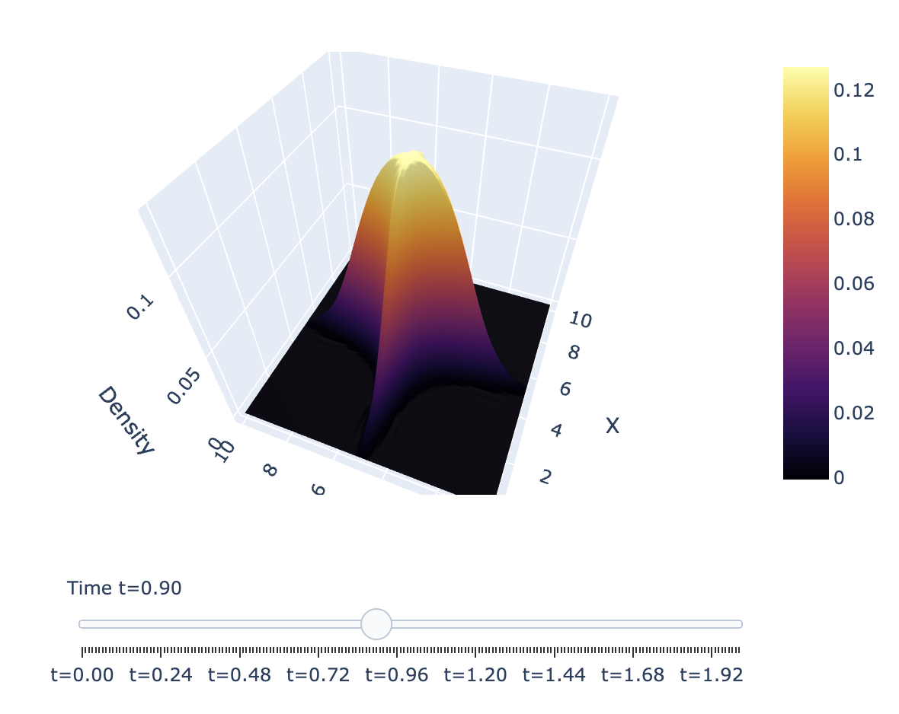

# mean-field

A [Jupyter notebook](https://colab.research.google.com/github/zfurman56/mean-field/blob/main/mean-field.ipynb) exploring the mean-field theory of neural networks, starting from the metaphor of Brownian dynamics. Interactive 2D and 3D visualizations included. 

